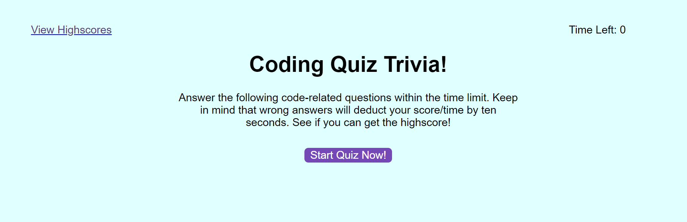
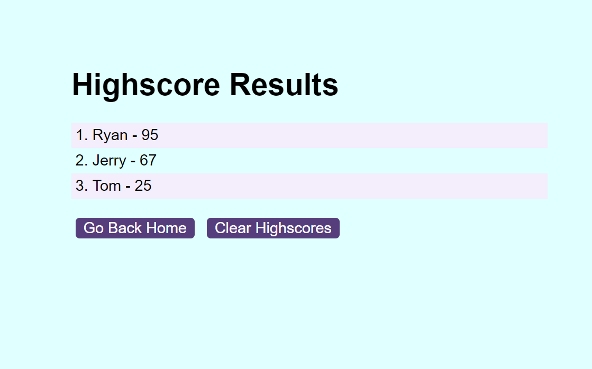

# <Interactive Code Quiz>

New to Coding or Programming? Test your knowledge with this Code Quiz App!
Practice your knowledge with this App so you don't have to make flashcards to study. Click the 'Start Quiz' to get started and test your coding knowledge.

## Description

Provide a short description explaining the what, why, and how of your project. Use the following questions as a guide:

- This is a unique project of mine that has helped me learn tough programming terms.
- This project is to help up and coming programmers to practice coding terms!
- This quiz helps individuals to be competitive in their knowledge of coding and to try and see if they can get a higher score then their friends.

## Installation

What are the steps required to install your project? Clone a copy of this repository from Github to get started!

## Features

A full list of coding questions to help with term retention. Please suggest any other questions and I can update the quiz.

## Tests

This has been tested on W3C markup validator and no errors or warnings to show.

## ScreenShot

## Credits

Ryan Anderson
